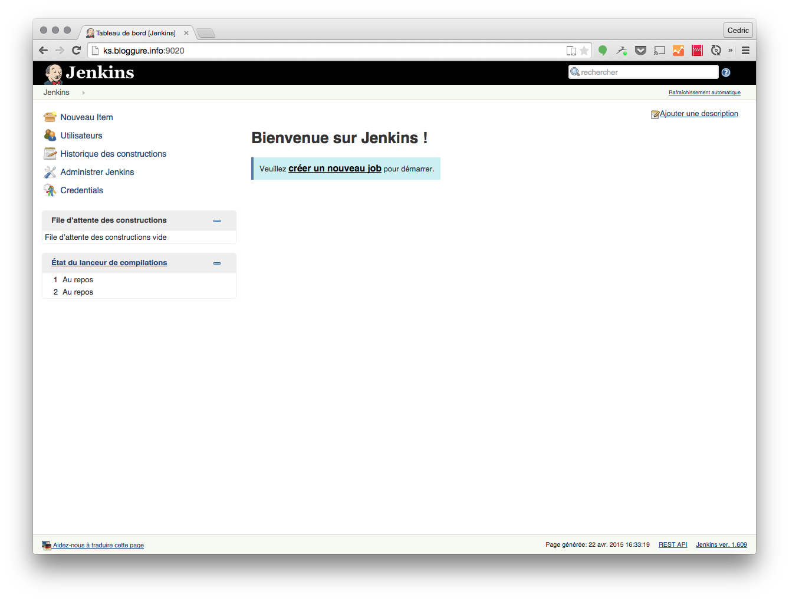
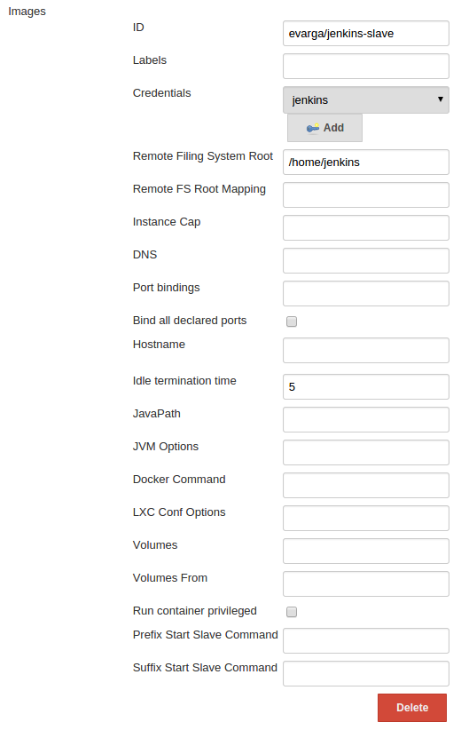
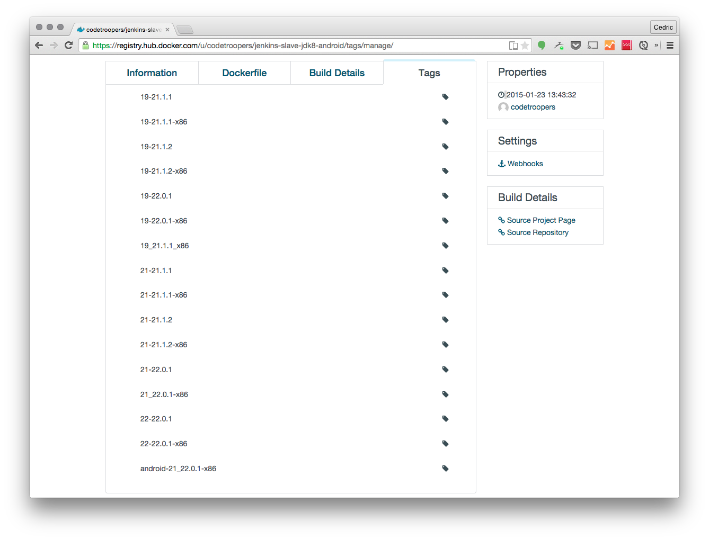

= Docker Jenkins Slave
:author: Cedric Gatay
:keywords: @Cedric_Gatay #BBL
:email: c.gatay@code-troopers.com
:backend: deckjs
:customcss: ct/ct.css
:customjs: ct/ct.js
:goto:
:menu:
:status:
:source-highlighter: pygments

// T'es qui ?
// == Qui
// Freelance
//
// Code-Troopers
// 
// BrownBagLunch
//
// Packt publishing
//

== Jenkins
image:assets/jenkins_docker.png[]

Serveur d'intégration continue

Permet de piloter des noeuds

 * WMI + DCOM
 * JNLP
 * SSH

== Pourquoi dans Docker?
//[role="notes"]
//NotesNotesNotes
// Pourquoi t'as eu envie de le faire ?
Jenkins évolue vite (weekly, LTS tous les mois)

Mises à jour un peu pénibles

 * wget du war
 * cp / restart

L'occasion de jouer avec Docker de façon "utile".

== Réinstallation nécessaire...
// Et pourquoi t'as eu besoin de réinstaller un CI
Notre ancien serveur était sur les genoux.

Projets internes avec des stacks différentes.

Pas envie de pourrir la config système comme sur l'ancien.

// == Archi cible
// Donc c'est quoi l'archi finale ?
//[graphviz]
// --------
// Host - [Docker]Jenkins -SSH- [Docker]Jenkins-slave
//                       \SSH- [Docker]Jenkins-slave
// --------
//
== Quickstart
// Ok, du coup comment on démarre ?
//Vu que le travail principal est fait, il suffit d'utiliser les bonnes images Docker
1. Docker Hub

2. Images préconfigurées

   * agileek/docker-jenkins
   * evarga/jenkins-slave

== agileek/docker-jenkins
//bitos pic
Maintenue par mbitard

//fork and knives
Fork de l'image officielle

//bleeding haxe
Bleeding edge

//is this relevant ?
//Montage du volume `JENKINS_HOME`

//Expose du port 8080

== evarga/jenkins-slave
Image avec OpenJDK7

Serveur SSH

Login `jenkins`/`jenkins`

//motor pic
== Gentlemen start your engines
[source, Bash]
------
docker run 
           -d 
           -p 8080:8080 
           -v /home/jenkins:/var/jenkins_home 
           agileek/docker-jenkins
------

//screenshot welcome

== Configuration Jenkins
Plugin Docker

Configuration :
 
 * nom d'image
 * volumes montés
 * label

== Configuration Jenkins

== Premier build
//ca marchera... mais
[options="step"]
image:assets/jenkins_sad.png[]

[options="step"]
 * pas de VCS dans l'image
 * pas d'outils préinstallés

[options="step"]
-> que pour un shell script

//maven télécharge internet / pas de checkout

== Personnalisation

// La personnalisation ? > check list
//comment personnaliser votre environnement?

//Prenez votre stack et listez ce qu'il faut installer
// Avec un exemple ? > pour nous 

[options="step"]
 * Détailler sa stack 
 * Chercher sur le registry
 * Construire son Dockerfile

[canvas-image="assets/aucard.jpg"]
== aucard poster

[role="canvas-caption", position="center-up"]
Aucard de Tours

== Aucard de Tours - Web
// Chez CT //// mettre le logo CT :) ////  on aime beaucoup restx, nos projets l'utilisant ont la stack suivante :@CT : Restx
image:ct/logo.png[height=128] 

[options="step"]
 * Git
 * Java 8 
// oui oui on fait du java 8 en prod !!
 * Maven
 * Sass/compass
 * npm
 * Bower
 * Grunt

== Décomposer

//Itération sur chaque élément pour se poser la question si une image "seule" est intéressante 
Quelles étapes sont intéressantes ? 

[options="step"]
 * Git X
 * Git + Java 8 Y
 * Git + Java 8 + Maven Y
 * Git + java 8 + Maven + sass N
 * Git + ... + Grunt Y

//En essayant de construire notre image, on a réussi a en faire trois en fait, qui pourront resservir 
== Factoriser
Trois images résultats :

[options="step"]
 * jdk8
 * jdk8-mvn
 * jdk8-mvn-restx

== Aucard de Tours - Android
//et pour Android ?
SDK lourd à installer:

[options="step"]
 * API
 * support repository
 * compat repository
 * images d'émulation

// on a fait le taff avec des images.

== Aucard de Tours - Android
Images préparées :

[options="step"]
 * images pour le build
 * images pour l'émulation (qemu x86) 

== Aucard de Tours - Android

//l'emulation nécessite de lancer les container en priviledged)
// on peut réutiliser vos images ? / Distribution sur DockerHub

== Points de douleurs
// T'as eu quoi comme problèmes ?
Le plugin Docker Jenkins est pas complétement sec

[options="step"]
 * configuration lourdingue
 * gestion des variables d'env difficile
 * pas de feedback rapide lors du pull des images 
//et ca peut prendre trois plombes)

//Un peu de gymnastique supplémentaire pour être capable de faire du DinD (Docker in Docker)
//[options="step"]
//-> Définir ce qui peut être éphémère
// cas du .m2/ .gradle si on veut des temps de build raisonnables
// warmup via un build pour peupler le .m2 / ou monter le volume

== Points de douleurs
Registry central : 
 
[options="step"]
 * builds en erreurs
 * recherche nulle

== Points de douleurs
Construction des Dockerfile
 
[options="step"]
 * copier/coller 
 * trouver le bon "héritage"

== D.R.Y.ness
//Beaucoup de copier / coller entre images

Ajout de mixins:

// Projet en cours pour apporter des mixins

[options="step"]
 * importer des fragments communs 
 * génerer un Dockerfile "composite"

[options="step"]
-> http://github.com/CedricGatay/manifest-mixin

[options="step"]
 * Cross platform (en Go comme Docker)
 * Très simple (mix'n merge)
 * Que pour des URLs (pour le moment)

[canvas-image="assets/mememe.jpg"]
== Ok, count me in
//image:assets/mememe.jpg[]

// Génial, comment je fais pareil ? 
== Slides
  * http://github.com/CedricGatay/slides-template/tree/docker-jenkins-slave

== Images

Accessibles sur 

 * http://github.com/code-troopers/docker-jenkins-slaves
 * https://registry.hub.docker.com/repos/codetroopers/

== Démo

* http://github.com/CedricGatay/slides-template/tree/bbl/20150731-jenkins-slave

[source,shell]
-------
# build and start a jenkins (pre pulls an image)
make
# get jenkins logs
make logs
# destroy everything
make clean
-------

[canvas-image="assets/tips.jpg"]
== Tips

== Debug slave en erreur

[source,bash]
------
myhost $ docker ps
myhost $ ssh jenkins@localhost -p$PORT
jenkins@a233dfe $ # do what you want to
------

== nginx en frontal
nginx en proxy : 

 * sur le port 80
 * router les requêtes par hostname
 
// http://jenkins.code-troopers.com:8080 -> UGLY

== Avec Docker ?
Image nginx pour gérer les vhosts:
[options="step"]
 * jwilder/nginx-proxy
 * `docker run -d 
           -e VIRTUAL_HOST=jenkins.code-troopers.com 
           -e VIRTUAL_PORT=8080
           agileek/docker-jenkins` 

== Bénéfices

//Notre serveur ne contient rien d'autre que le daemon Docker
 * Serveur propre
 * Builds reproductibles
 * Montée en compétence Docker

[canvas-image="assets/trooper_dance.jpg"]
== on est hype !
[role="canvas-caption", position="left-bottom"]
Merci !